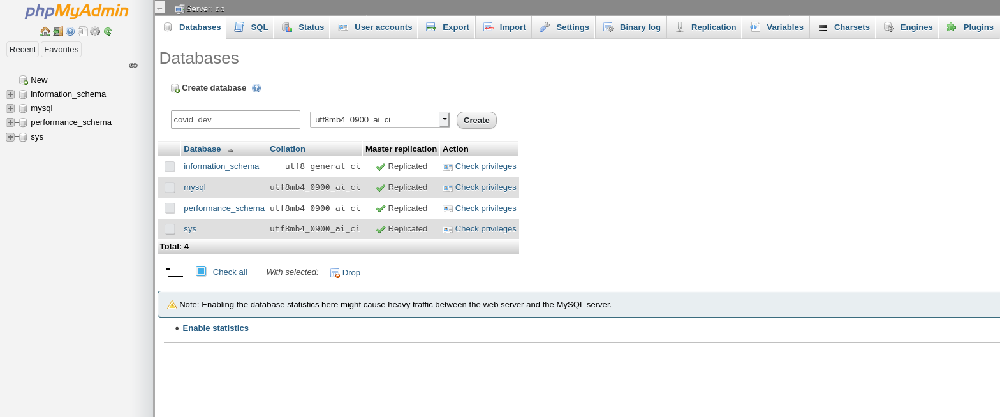

# Install

For installing the analysis scripts

## Install python
We recommend that you activate a virtual environment as follows:

```sh
python -m venv .venv
source .venv/bin/activate
```

and install:

```bash
sh python_install.sh
```

If you run from analysis-script folder, you might want to set up the PYTHONPATH as below:
`export PYTHONPATH=$PWD/analysis:$PYTHONPATH`

## Install docker
```bash
sh docker_install.sh
```

## Update .env file

First copy the template `.env.dist` to `.env`. The file `.env.dist` contains:

```bash
# firebase vars
READ_API_URL='https://your_project.cloudfunctions.net/export_json'
READ_TOKEN=''

#docker containers
MYSQL_PORT=3306
PHPMYADMIN_PORT=9000
DOCKER_COVID_MYSQL="docker.covid.mysql"
DOCKER_COVID_ADMIN="docker.covid.phpmyadmin"

# point to your dataset repo
PUBLIC_DATASETS_REPO_RELATIVE_PATH='../datasets'

# other vars
DATABASE_NAME=covid_dev

# your country geocoding file 
GEOCODING_RAW_FILE_URL = "https://raw.githubusercontent.com/covidmap-sweden/geo-locations/master/data/swe/swe_geocoding.csv"
```
Contact the maintainers for `READ_API_URL` and `READ_TOKEN`.

## Run docker

Warning, this script is also killing the container berfore restart. So you need to do it once.
```bash
sh docker_run.sh
```

## Create the database

1. Connect to phpmyadmin (http://localhost:9000/db_structure.php) and login
   with username `root` and password `root`.
2. You have to create a database (default: covid_dev) with the same name as in the .env file.
   

Now follow the steps in [run.md](run.md)
